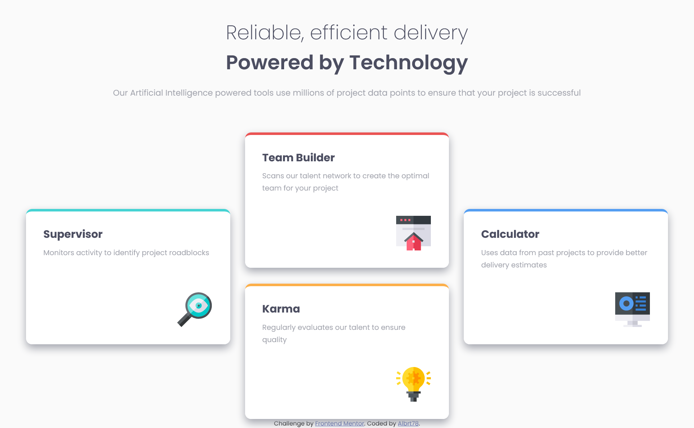

# Frontend Mentor - Four card feature section

## Welcome! 👋

Thanks for checking out this front-end coding challenge.

[Frontend Mentor](https://www.frontendmentor.io) challenges help you improve your coding skills by building realistic projects.

# Frontend Mentor - Four card feature section solution

This is a solution to the [Four card feature section challenge on Frontend Mentor](https://www.frontendmentor.io/challenges/four-card-feature-section-weK1eFYK). Frontend Mentor challenges help you improve your coding skills by building realistic projects.

## Table of contents

-   [Overview](#overview)
-   [The challenge](#the-challenge)
-   [Screenshot](#screenshot)
-   [Links](#links)
-   [Built with](#built-with)
-   [Author](#author)

## Overview

Frontend Mentor is an online platform that provides challenges for web developers to improve their skills by building realistic projects. These challenges typically involve creating frontend designs based on provided designs or specifications.

### The challenge

Users should be able to:

-   View the optimal layout for the site depending on their device's screen size

### Screenshot

### Links

-   Solution URL: [Four Card Feature](https://github.com/Albrt78/fourcardfeature.github.io)
-   Live Site URL: [Four Card Feature](https://albrt78.github.io/fourcardfeature.github.io/)

### Built with

-   Semantic HTML5 markup
-   CSS custom properties
-   CSS Grid
-   [SASS](https://www.google.com/url?sa=t&source=web&rct=j&opi=89978449&url=https://sass-lang.com/&ved=2ahUKEwimuOHJ7OmEAxWIxzgGHc7BD64QFnoECAcQAQ&usg=AOvVaw0p_IRgLEbIPRGWtlW7Wph8) - CSS Prepocessor

## Author

-   Frontend Mentor - [@Albrt78](https://www.frontendmentor.io/profile/Albrt78)
